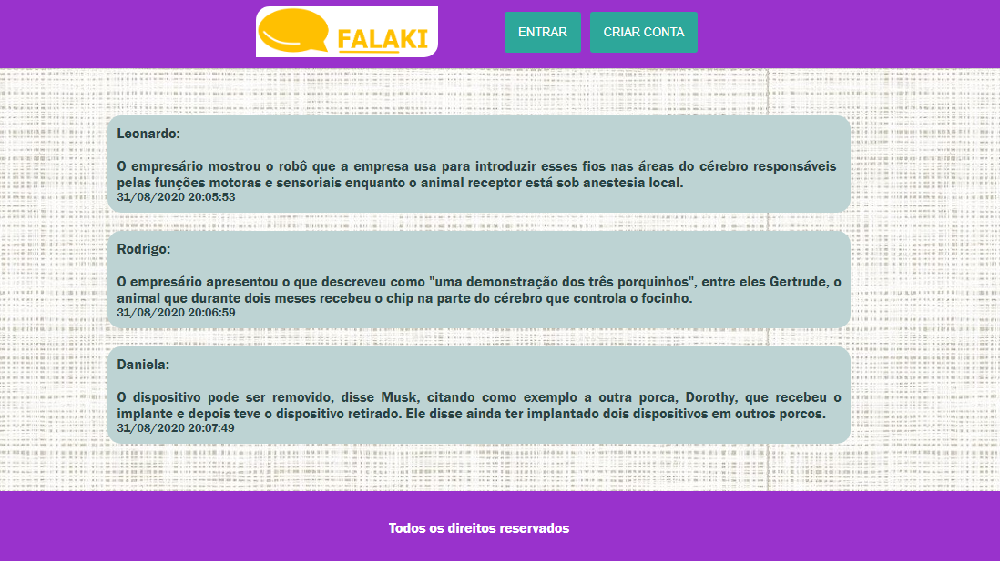
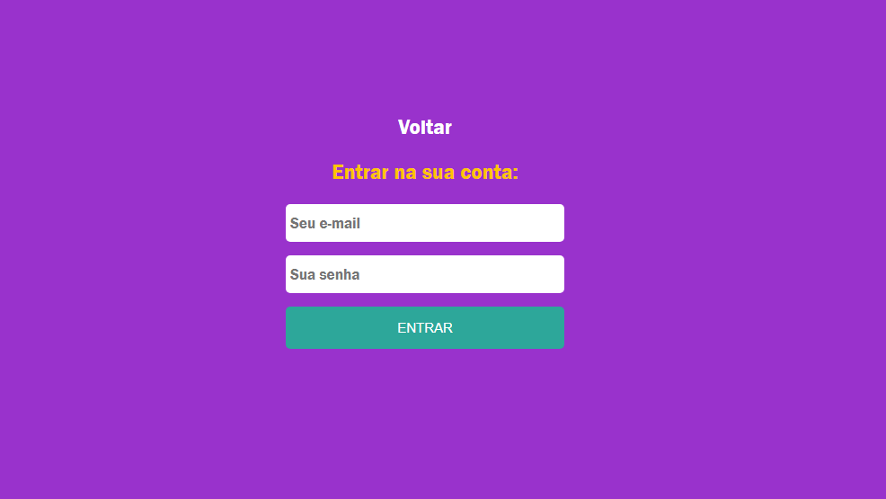
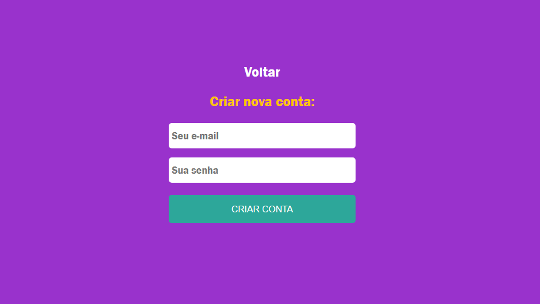
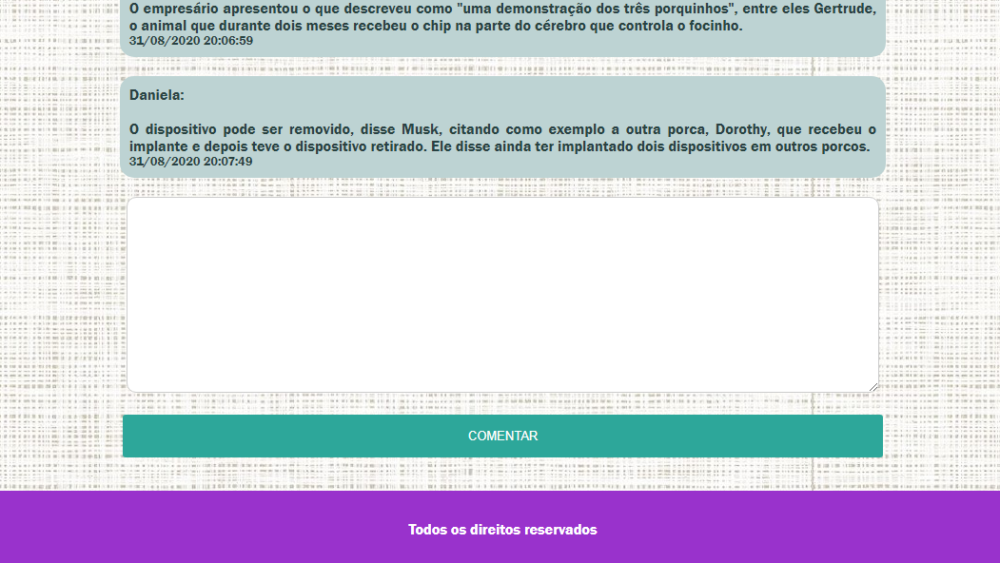
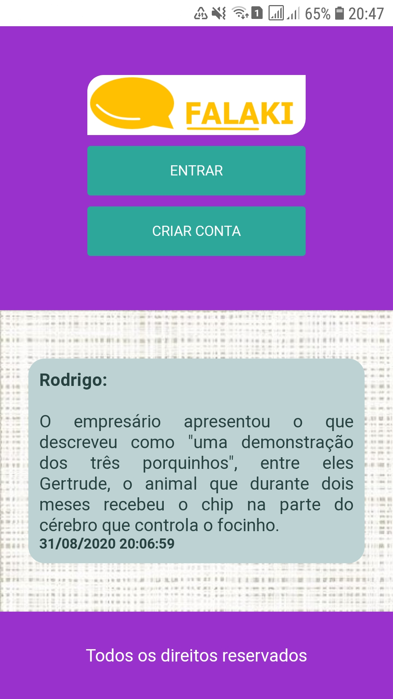

Este projeto é um sistema básico de comentários tendo como principais tecnologias ReactJs com hooks e NodeJs.  
Este projeto utiliza o hook useContext para compartilhamento de dados de login do usuário.  
O Firebase foi utilizado como backend da aplicação, auxiliando com o sistema de login e armazenamento de comentários.  

O projeto pode ser acessado pelo link a seguir: https://comentakiprojeto.web.app/. 
Temos abaixo a tela inicial do sistema:   
  
Após clicar no botão "Entrar", o usuário é direcionado para a tela de login:   
  
Ao acessar a opção "Criar Conta", o usuário deverá criar seu acesso pela tela a seguir:  
  
O campo para comentar só fica disponível após fazer login:   

Segue a versão responsiva da aplicação:  

